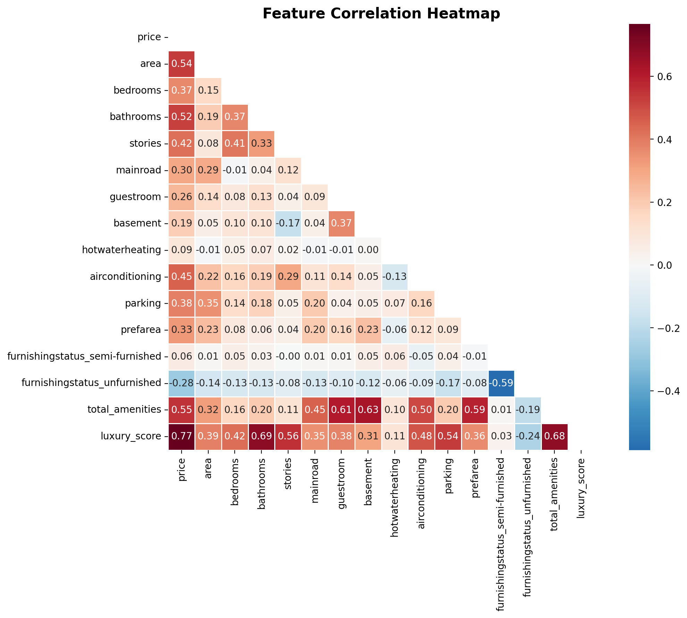
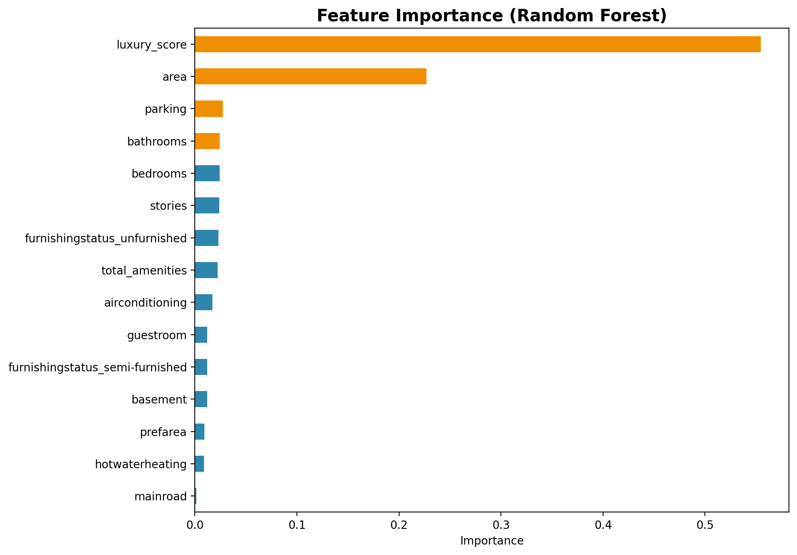
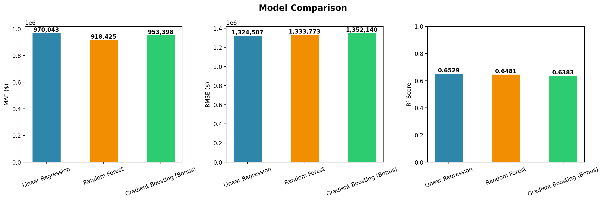

# 🏠 House Price Prediction - Regression & Feature Engineering

This repository contains a complete machine learning project predicting house prices using the Kaggle **Housing Prices Dataset**. The project compares multiple regression models, performs feature engineering to boost accuracy, and extracts actionable business insights.

## 📋 Project Overview
Real estate valuation is often based on comparative analysis or subjective estimations. This project implements a data-driven approach to:
1. **Analyze** the relationships between house price and structural features.
2. **Engineer** composite features (like `luxury_score`) to capture complex amenity interactions.
3. **Train & Evaluate** three regression models: Linear Regression, Random Forest, and Gradient Boosting.
4. **Identify** the most influential drivers of property values.

---

## 📁 Repository Structure
```
HousePricePrediction_MaviyaMustahsin/
│
├── analysis.ipynb      # Clean, fully-executed Jupyter notebook
├── Housing.csv         # Kaggle Housing dataset (545 rows)
├── summary.pdf         # Professional PDF report of the findings
├── summary.md          # Markdown version of the report
└── charts/             # Generated analytical visualizations (PNG)
    ├── 01_price_distribution.png
    ├── 02_correlation_heatmap.png
    ├── 03_actual_vs_predicted.png
    ├── 04_feature_importance.png
    ├── 05_price_vs_area.png
    └── 06_model_comparison.png
```

---

## 📈 Model Performance & Comparison

Three models were trained and evaluated on an 80/20 train-test split, validated using 5-Fold Cross-Validation.

| Model | MAE | RMSE | R² Score | Cross-Val R² |
| :--- | :---: | :---: | :---: | :---: |
| **Linear Regression** | **$970,043** | **$1,324,507** | **0.6529** | **0.5828** |
| Random Forest | $918,425 | $1,333,773 | 0.6481 | 0.5743 |
| Gradient Boosting | $953,398 | $1,352,140 | 0.6383 | 0.5401 |

*Note: Linear Regression emerged as the most robust and consistent model for this dataset size.*

---

## 💡 Key Insights & Feature Importance

1. **Smart Feature Engineering Works**: 
   Our engineered composite feature `luxury_score` (combining bathrooms, stories, parking, and amenities) is the **#1 predictor** of price with a Random Forest feature importance of **0.555**.
2. **Size is a Major Driver**: 
   Property `area` is the strongest individual original feature (importance: **0.227**).
3. **Bathrooms > Bedrooms**: 
   Buyers place a higher premium on bathrooms than bedrooms, suggesting a preference for luxury and convenience over pure room count.
4. **Air Conditioning vs. Heating**: 
   Air conditioning shows a strong positive correlation with price (**0.45**), whereas hot water heating has almost no impact (**0.09**).

---

## 📊 Visualizations

Here are some of the key charts generated during the analysis (available in the `charts/` folder):

### 1. Feature Correlation Heatmap
Shows the relationships between all features. `luxury_score` and `area` have the strongest positive correlation with price.


### 2. Random Forest Feature Importance
Demonstrates that the engineered `luxury_score` dominates predictive power.


### 3. Model Evaluation & Comparison
Compares the Mean Absolute Error (MAE), Root Mean Squared Error (RMSE), and R² Score of all three models.


---

## 🛠️ Tech Stack & Libraries
- **Language**: Python 3.x
- **Libraries**: `pandas`, `numpy`, `scikit-learn`, `matplotlib`, `seaborn`
- **Environment**: Jupyter Notebook / VS Code

---

## 👤 Author
* **Maviya Mustahsin** - *Data Science Intern*
* Date: June 2026
